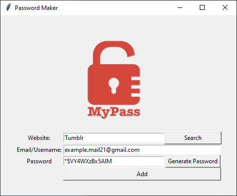
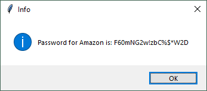
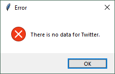

# Password Manager
> It's a password managing app, the pourpose of which is to keep track of your passwords.

## Table of contents
* [General info](#general-info)
* [Screenshots](#screenshots)
* [Technologies](#technologies)
* [Setup](#setup)
* [Status](#status)

## General info
Main goal of the project was to create app which can generate a password in accordance with the requirements of most websites.
Manager is keeping passwords in JSON format.
Search button gives the user the option to search for password of a particular website. 
User will be informed abut the outcome via dialog window - exmamples are shown in Screenshots section.

If the user wants to save a password for an existing website, the old one will be replaced.

## Screenshots
|  |  |  |  
|:--:|:--:|:--:| 
| *Main window* | *Dialog window* | *Dialog window* |

## Technologies
* Python 3.8
* Tkinter 8.5

## Setup
Install missing libraries if necessary.

## Status
Project is: _finished_.
